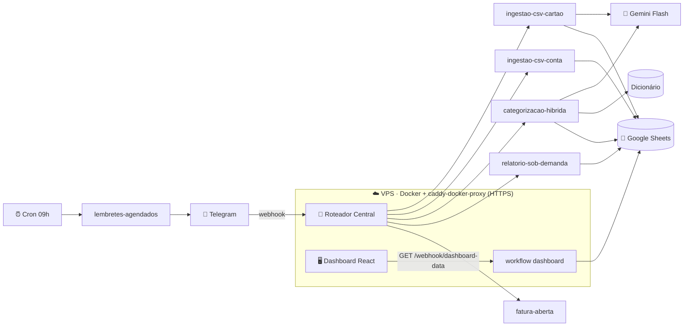

<div align="center">

# 💰 Bot Financeiro Doméstico

**Controle financeiro de casal via Telegram — extração, categorização e dashboard, sem planilha na mão.**

Extratos do C6 Bank entram pelo Telegram, o [n8n](https://n8n.io) orquestra, o [Gemini Flash](https://ai.google.dev) lê PDFs e categoriza, o [Google Sheets](https://www.google.com/sheets/about/) guarda tudo, e um dashboard web mostra o rateio da "reunião familiar".


</div>

---

## ✨ O que ele faz

- 📥 **Ingestão automática** — você encaminha o ZIP da fatura do C6 (cartão) ou o CSV da conta corrente pelo Telegram; o bot extrai os lançamentos.
- 🧠 **Categorização híbrida** — Dicionário de regras → Gemini Flash → ajuste manual via Telegram → a escolha vira nova regra no Dicionário.
- 🗓️ **Regime de caixa** — lançamentos de cartão têm a data reescrita para o dia 10 do mês seguinte ao da fatura (quando o dinheiro realmente sai).
- ✅ **Aprovação humana** — toda importação pede confirmação no Telegram antes de gravar.
- 🔔 **Lembretes agendados** — avisa sobre contas fixas a vencer.
- 📊 **Relatórios sob demanda e mensais** direto no chat.
- 🎯 **Metas temporárias** com acompanhamento de progresso.
- 🖥️ **Dashboard web "Reunião Familiar"** — rateio proporcional ao salário entre o casal, saldo de cada um com a casa, fatura aberta e projeção de parcelas futuras.
- 📝 **Auditoria** — toda alteração de dados é registrada na aba `Log`.

## 🏗️ Arquitetura



O **Roteador Central** apenas roteia; cada responsabilidade é um sub-workflow isolado (ver [AGENTS.md](AGENTS.md) e [HANDOFF.md](HANDOFF.md)).

## 🧰 Stack

| Camada | Tecnologia |
|---|---|
| Orquestração | n8n self-hosted (Docker) |
| Interface | Telegram Bot (usuário único) |
| LLM | Gemini Flash — extração de PDF + categorização |
| Banco de dados | Google Sheets |
| Dashboard | React + Vite + Tailwind + ApexCharts |
| Proxy / HTTPS | Caddy via `caddy-docker-proxy` (Let's Encrypt automático) |
| Túnel (dev) | ngrok |

## 🌐 Produção

O bot roda numa VPS com `caddy-docker-proxy` (HTTPS automático, rede Docker compartilhada entre projetos):

- **n8n / webhooks:** `https://financeiro.minhaautomacao.cloud`
- **Dashboard:** `https://financeiro.minhaautomacao.cloud/dashboard` (protegido por senha)

A stack de produção fica em [`docker-compose.vps-shared.yml`](docker-compose.vps-shared.yml). Runbook completo de deploy: **[DEPLOY.md](DEPLOY.md)**.

> O dashboard é servido por um build estático (nginx multi-stage) e roteado em subpath via label `caddy.handle_path: /dashboard*`, compartilhando origem com o n8n — sem CORS extra.

## 🚀 Rodando localmente (dev)

1. Copie `.env.example` → `.env` e preencha os segredos (token do Telegram, chave Gemini, senha do ZIP do C6, ID da planilha, senha do dashboard).
2. Suba o n8n:

   ```powershell
   docker compose up -d                      # só n8n  →  http://localhost:5678
   docker compose --profile tunnel up -d     # n8n + ngrok (para receber webhooks do Telegram)
   ```

3. Acesse `http://localhost:5678` e crie a conta de owner do n8n.
4. Importe os workflows versionados:

   ```powershell
   scripts\import-workflows.ps1
   ```

5. (Opcional) Rode o dashboard em modo dev:

   ```powershell
   cd dashboard-web
   npm install
   npm run dev
   ```

> ⚠️ Segredos **sempre** via `.env` / variáveis de ambiente — nunca hardcoded. O `.env` e a pasta `Dados CSV/` (extratos reais) nunca são commitados.

## 📁 Estrutura

| Pasta / arquivo | Conteúdo |
|---|---|
| `workflows/` | Workflows n8n exportados em JSON (versionados) — 13 em produção + casos de teste |
| `workflows-harumi/` | Bot Financeiro da Harumi — mesma instância n8n, banco Notion (não Sheets), sem rateio |
| `dashboard-web/` | SPA React do dashboard "Reunião Familiar" |
| `dashboard-web-harumi/` | Variante do dashboard para a Harumi (`/dashboard-harubs`, sem rateio, lê do Notion) |
| `scripts/` | Export/import de workflows via CLI do n8n |
| `docker-compose.yml` | Stack local (n8n + ngrok) |
| `docker-compose.vps-shared.yml` | Stack de produção (n8n + dashboard, labels do Caddy) |
| `gstack/` | Specs, planos, retrospectivas e handoffs (estado do projeto) |
| `Dados CSV/` | Amostras reais de extrato/fatura C6 — **fora do git** |
| `.claude/` | Subagentes e skills do time multi-agente |

## 📐 Regras de negócio (resumo)

- **Cartão:** estorno + par idêntico se cancelam (registrado no Log); `Inclusão de Pagamento` é ignorado.
- **Conta corrente:** transferências entre contas próprias **não** são ignoradas; o CSV tem 8 linhas de metadata + BOM UTF-8.
- **Parser nunca trava o workflow:** formato inesperado notifica via Telegram e segue.

Detalhes completos e o racional das decisões em **[HANDOFF.md](HANDOFF.md)**.

## 🤖 Ciclo de trabalho (gstack)

O projeto foi construído com um time multi-agente (Claude Code):

**Think → Plan → Build → Review → Test → Ship → Reflect**

Specs em `gstack/specs/`, revisão de plano pelo `plan-reviewer`, build no n8n, `code-reviewer` no JSON exportado, `workflow-qa` contra os CSVs reais, e `security-officer` antes de expor segredos. Roteamento dos agentes em **[AGENTS.md](AGENTS.md)**.

---

<div align="center">
<sub>Projeto pessoal de controle financeiro doméstico · construído com n8n + Claude Code</sub>
</div>
